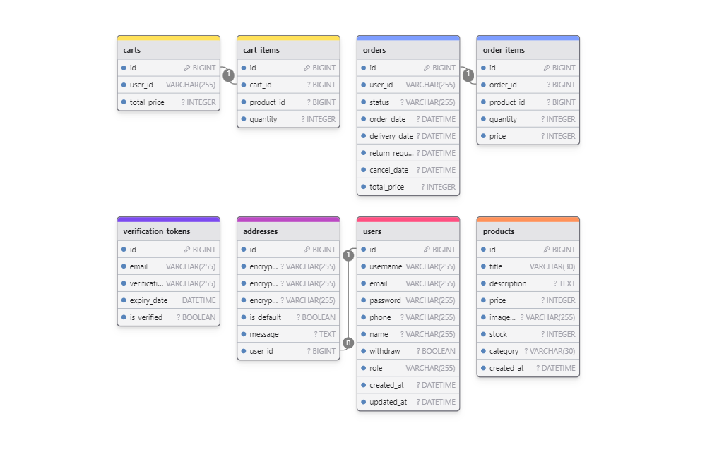

# 📈 1001eyes

목차

- [Overview](#Overview)
- [ERD](#ERD)
- [Architecture](#Architecture)
- [Tech Stack](#Tech-Stack)
- [Main Feature](#Main-Feature)
- [성능 개선](#성능-개선)

[//]: # (- [Trouble Shooting]&#40;#Trouble-Shooting&#41;)

## Overview

1001eyes는 한정판 제품을 구매하는 상황을 기반으로 한 이커머스 프로젝트입니다.  
MSA 구조를 적용하여 모듈 간 독립성을 강화하고 대규모 트래픽을 처리하기 위해  
안정적인 구매 프로세스를 제공하는 것을 목표로 설계되었습니다.

- 개발 기간: 2024/08/07 ~ 2024/09/04 (4주)
- [API 명세서](https://documenter.getpostman.com/view/33051866/2sA3s7ho4p)

## ERD

## Architecture

## Tech Stack

기술 스택

  
| **Tech**       | **Usage**                  |
|----------------|----------------------------|
| **Language**   | Java 21                    |
| **Framework**  | Spring Boot 3.3.2          |
| **Build**      | Gradle                     |
| **Database**   | MySQL 8.0.30               |
| **ORM**        | Spring Data JPA            |
| **Cache**      | Redis (Redisson 3.21.0)    |
| **Cloud**      | Spring Cloud 2023.0.3      |
| **Service Discovery** | Spring Eureka       |
| **API Gateway**| Spring Cloud Gateway 4.1.5 |
| **Library**    | Feign Client               |
| **Library**    | JJWT (0.11.5)              |
| **Library**    | Spring Boot Mail (3.1.2)   |
| **Load Testing** | JMeter                   |
| **DevOps**     | Docker (25.0.3)            |

## Main Feature

- 이메일 인증을 통한 회원가입
  - Google SMTP를 사용하여 회원가입시 인증 코드 발송 구현

- 개인정보 암호화 (AES 알고리즘)
  - 16바이트 암호화 키를 통해 암호화 및 복호화
  - 암호화된 데이터는 Base64 인코딩을 통해 저장

- Redis 캐싱을 통한 재고 관리
  - 상품 재고를 캐싱하여 rdb 보다 가벼운 조회 기능 제공 
  - Redis 분산락(Redisson의 rLock)을 활용하여 재고 차감 시 동시성 문제 해소

- 페인 클라이언트를 통한 서비스 간 통신
  - 마이크로서비스 간의 효율적인 통신을 위해 API 호출을 간편하게 구현

- Netflix Eureka를 이용한 Client-side Discovery 방식의 Service Discovery 구현
  - Eureka 서버를 통해 서비스 등록 및 검색 가능
  - Eureka 클라이언트로 서비스 간 동적 로드 밸런싱 제공

- API 게이트웨이를 통한 라우팅 및 인가 기능
    - 마이크로서비스 간의 경로 설정을 통해 클라이언트 요청을 적절히 분배
    - JWT 토큰을 사용한 인가 필터 적용  

- 스프링 스케줄러를 활용한 상태 관리
  - 주기적인 주문 상태 업데이트 구현
  - 임시 주문데이터 TTL 만료시 캐싱 재고 복구 로직
  - slack 알림 전송으로 모니터링

## 성능 개선

### 주문 진입 로직 리팩토링

- **[Before]** DB 직접 조회 + 주문 데이터 db에 저장
- **[After]** 재고 캐싱 활용 + 임시 주문 데이터 레디스에 저장
  - Look-aside 캐싱 전략 적용 : 평균 응답 속도 **약 99% (1666ms → 10ms)** 향상

### 구매 프로세스 이탈 상황 처리

- 주문 진입 상태 (PENDING), 결제 진입 상태 (PAYING)로 10분 경과시  
  구매 의사 없다고 가정 -> 스케줄러로 레디스 TTL 체크 후 임시 주문 데이터 제거 및 재고 복구

### 동시성 문제 해소

- 비관적 락 / 분산 락 적용 후 주문 데이터 및 재고 정합성 유지
- 부하 테스트
  - 테스트 시나리오 1 : 1만명 요청, 상품 재고 : 1만개 -> 예상 결과 (에러x 및 1만건의 주문 데이터 생성 및 재고 일치)
  - 테스트 시나리오 2 : 1만명 요청, 상품 재고 : 10개 -> 예상 결과 (99.90% 에러 및 10명만 주문에 성공한다.)
  - [테스트 결과 링크](https://github.com/hhhyeon97/1001eyes/wiki/%EB%B6%80%ED%95%98%ED%85%8C%EC%8A%A4%ED%8A%B8-%EA%B2%B0%EA%B3%BC)

[//]: # (## Trouble Shooting)

<!--

[맨 위로](#1001eyes)

 -->
